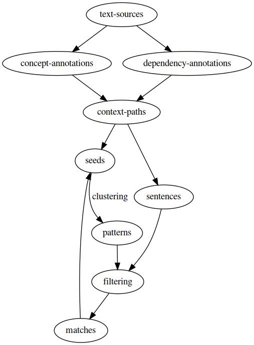

## Semi-supervised relation extraction using word vectors and syntax patterns

**Presenter:** Harrison Pielke-Lombardo

**Advisor:** Lawrence Hunter

**Institution:** University of Colorado, Anschutz Medical Campus

---?color=#E58537
@title[Background]

@snap[north span-100]
## Background
@snapend

@snap[west span-50]
@ul[spaced text-white](false)
- Relation extraction lets us go beyond just using mentions in text
- Previous approaches
  - Regular expressions and patterns
  - Supervised methods
  - One-shot learning language models
@ulend
@snapend

@snap[east span-50]

@snapend

---
@title[Method]
## Method

@snap[west span-50]
@ul[spaced]
- Dependency path between two entities -> context path
- Combine word vectors -> context vectors
- Bootstrapping
  - Seeds
  - Clustering -> patterns
  - Context similarity
@ulend
@snapend

@snap[east span-50]

@snapend

---
@title[Results]
## Results

@snap[west span-50]
@ul[spaced]
@ulend
@snapend

@snap[east span-50]

@snapend

---
@title[Conclusion]
## Conclusion

@snap[west span-50]
### Contact
@ul[spaced]
- Email: Harrison.Pielke-Lombardo@ucdenver.edu
- GitHub: https://github.com/tuh8888
- Project: https://github.com/tuh8888/Dep2Rel
@ulend
@snapend